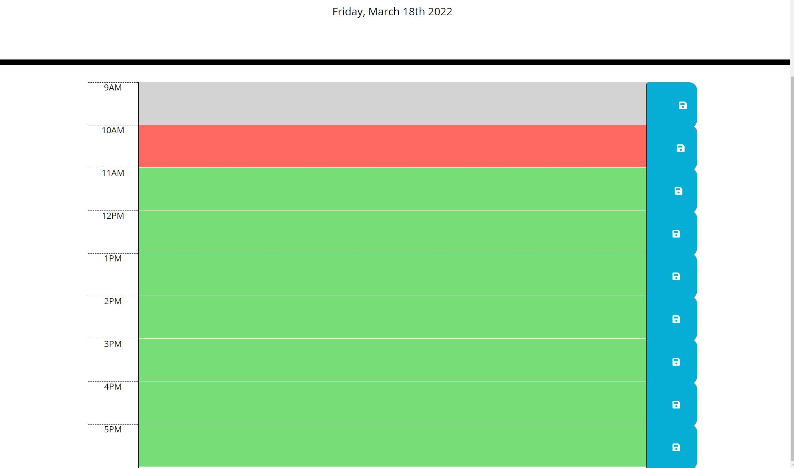

# Work Day Scheduler 
## This is a daily work schedule that you can utilize to organize your work day from 9AM to 5PM

### Each time block is color coded to show your present time
### Your present time block will display the color RED
### Your past time block will display the color GRAY
### Your futre time block will display the color GREEN
### Below is an example of how the page will look like

### You can add task and save your task by clicking the save button on the right hand side

## Here is the link to the website:
https://avuong19.github.io/workday-schedulerr/

